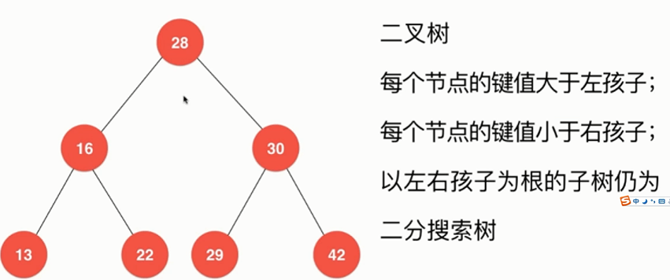
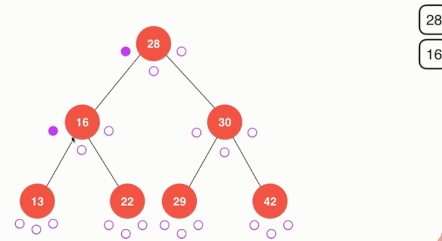
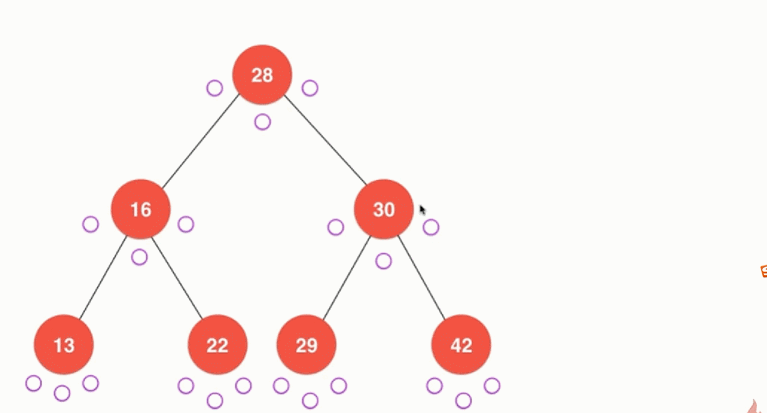

# 二分搜索树

### 作用
能高效的解决查找问题。一般用来左查找表的实现(字典数据结构)

对于查找元素、插入元素、删除元素。二分搜索树的时间复杂度都仅 O(logN), 可以高效的动态维护数据。
还可以方便的回答下列数据间的关系问题：
min, max, floor, ceil, rank, select

### 特征
> 二分搜索树不一定是一个完全二叉树
> 每一个节点大于它的左孩子，小于它的右孩子。
> 每一个节点将大于它左子树中所有的值，并且小于它所有右子树中所有的值



## 插入新节点
从根节点开始，依次比较当前节点与待插入节点的大小，如果小于当前节点，则插入到它的左子树，如果大于当前节点，则插入到他的右子树


```cpp
Node* insert(Node *node, Key key, Value value) {
  //如果节点为空，那么生成一个节点返回
  if(node == NULL) {
    count ++;
    return new Node(key, value);
  }
  //如果节点的key值相同，那么让新的value覆盖旧的value
  if( key == node->key ) {
    node->value = value;
  }
  //key值不等，需要查找它的左右子树
  else if( key < node->key) {
    node->left = insert(node->left, key, value);
  }
  else {
    node-> right = insert(node->right, key, value)
  }
  return node;
}
```

## 二分查找树的查找
```
/**
 * 在以node为根的二叉搜索树中查找key对应的value
 * 如果不存在这个key的话返回NULL, 所以返回类型为Value*
 */
Value* search(Node* node, Key key) {
  
  if(node == NULL) {
    return NULL;
  }
  if(node->key == key) {
    return &(node->value);
  }
  else if(key < node->key) {
    return search(node->left, key);
  }
  else{
    return search(node->right, key);
  }
}
```

## 遍历
### 前序遍历
先访问当前节点，再依次递归访问左右子树

### 中序遍历
先递归访问左子树，再访问自身，再递归访问右子树

### 后序遍历

先递归访问左右子树，再访问自身节点