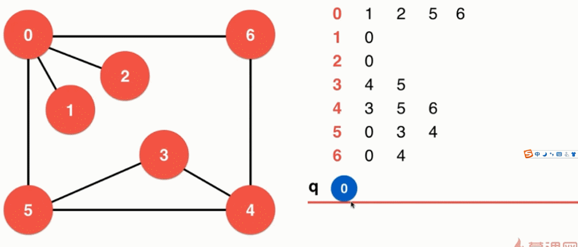

# 图论
图由相互连接的点和边构成。

图可按边是否有方向分为无向图和有向图。
图可按边是否有权重分为无权图和有权图。

图的连通性，即是否图中所有点都连接在一起。

自环边，从一个节点出发回到自身的边。
平行边，从一个节点到另一个节点间同时存在几条边。

## 图的表示
#### 邻接矩阵
邻接矩阵适合表示稠密图

#### 邻接表
邻接表适合表示稠密图

## 深度优先遍历

### 获得两点间的一条路径
在深搜的过程中，记录从到底是哪个节点到这个节点来的。
在找路径时，从目标节点一直倒退到源节点，因为有存了每个节点是从哪来的。将这个倒着退的过程压栈，然后再出栈，就可以获得从源节点到某节点的一个路径。

## 广度优先遍历

将一个元素入队后，检测队首元素相连的节点，将这些节点入队。

广度优先遍历还有个好出就是可以算出任一节点离根节点最短所要用的距离和能求出无权图的最短路径

