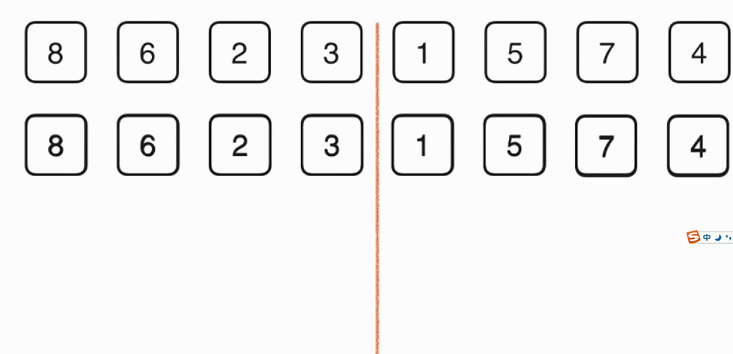
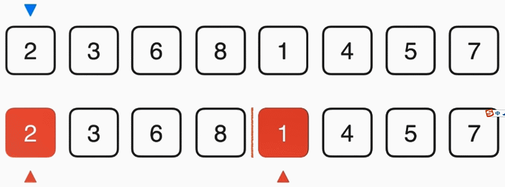
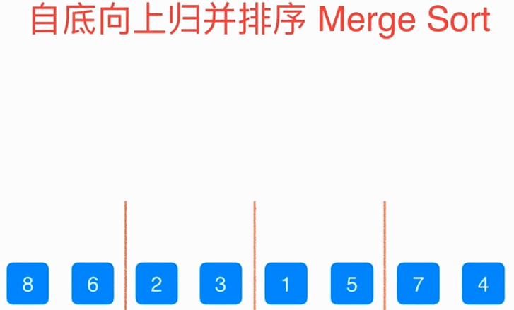

# 归并排序

## 思想

先将数不断的二分，一个长度为 N 的数组在 log N 次二分后每一个部分就只剩下一个元素了，然后逐层向上归并。向上归并时，每次将挨着的两个部分合为一个部分，合的过程是将两个有序数组合并，这是一个 O(n)级的排序过程。这样就可以实现归并排序了。

## 缺点
需要开辟临时的存储空间，这个存储空间的大小等同于被排序数组大小。

## 优化

### 在merge操作前判断
在merge操作前，如果判断数组前一半元素都比后一半元素小的时候就不需要进行merge操作了。因为merge操作是将有序的两个部分进行合并，所以比较arr[mid]与arr[mid-1]的大小就可以判断是否需要这次归并了。

### 当数据量小的时候使用插入排序进行优化
当递归到数据量比较小的时候可以转而使用插入排序队大多数 O(NlogN) 的排序进行优化。原因有以下两点：
1. 当数据量比较小的时候，数组近乎有序的概率就比较大，此时用插入排序有优势
2. 虽然插入排序最差的时间复杂度是 O(n^2) 级别的，但归并排序是 O(NlogN) 级别的。虽然级别不同，但我们在计算时间复杂度的时候是忽略了一个常数的系数的，而插入排序的常数是比归并排序小的。 所以，当数组大小小到一定程度时，插入排序是会比归并排序块的。

## 合并两个有序数组

### 思想
对两个有序数组，比较当前数组索引指向的值位置谁更小，把更小的元素放到对应位置。然后向后移动索引。
相当于两个队列比较队首元素，将较小的元素出队，然后压入目标栈中。

1. 需要开辟一个相同大小的临时空间。
2. 定义3个索引游标。待合并的两个数组各一个索引，指向当前需要考虑的元素；被排序的数组上一个，指向再归并过程中需要跟踪的位置。

# 自底向上的归并排序

## 思想
普通的归并排序是先把数组不断二分只至只剩一个元素时进行merge操作，而自底向上的归并排序则是直接使用for循环，从两个元素开始进行merge操作，然后每一轮扩大merge的范围。

## 优点
在自底向上的排序中没有直接使用数组索引获取元素。所以它**可以实现用 O(NlogN) 的时间复杂度队链表进行排序**。