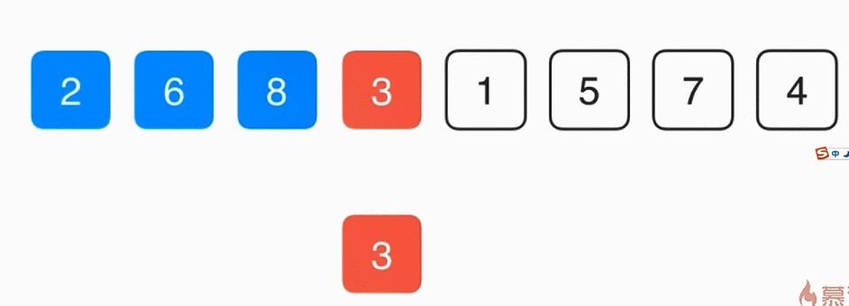

# 插入排序 O(2)

## 思想

类似与整理扑克牌

第 0 个元素不遍历；
第 1 个元素与它前面的第 0 个元素比较，如果它比前面元素大，那么交换这两个元素；
第 2 个元素与它前面的第 1 个元素比较，如果它比前面元素大，那么交换这两个元素，再接着与第 0 个元素进行比较
...
第 n 个元素依次与他前面的元素进行比较，直到它前面的元素比他小就 break;

## 优点

相对于其他 O(2) 算法， 插入排序的优点是能在内层循环中提前结束。
所以，对于**近乎有序的数组**，插入排序会让排序变得超级快！

## 普通的插入排序缺点

在依次与前面的元素比较时，只要前面比当前元素大就交换，这样频繁的交换会导致算法效率很低。因为每次交换会有 3 次赋值，而且还有数组的访问会耗时。

## 优化

为当前元素保存一个副本，依次向前遍历前面的元素是否比自己大，如果比自己大就直接把前一个元素赋值到当前元素的位置，当前某位置的元素不再比当前元素大的时候，将当前元素的值赋值到这个位置。

以直接一次赋值的方式代替交换时 3 次赋值的方式，明显的提升了效率


## 出现的错误

错误一：错误的将内层写为 i + 1, 外层为 0， 这样会导致越界

错误二：else 的作用域,所以要打{}

```
内层循环中：
for (j = i; j > 0; j--)
{
  if ( arr[j - 1] > curItem)
    arr[j] = arr[j - 1];
  else
    arr[j] = curItem;   //在这里赋值就会出错
    break;
}
```
