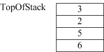
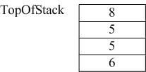

## 中缀表达式转后缀表达式
### 1. 规则

中缀表达式a + b*c + (d * e + f) * g，其转换成后缀表达式则为a b c * + d e * f  + g * +。

转换过程需要用到栈，具体过程如下：

1. 如果遇到操作数，我们就直接将其输出。

2. 如果遇到操作符，则我们将其放入到栈中，遇到左括号时我们也将其放入栈中。

3. 如果遇到一个右括号，则将栈元素弹出，将弹出的操作符输出直到遇到左括号为止。注意，左括号只弹出并不输出。

4. 如果遇到任何其他的操作符，如（“+”， “*”，“（”）等，从栈中弹出元素直到遇到发现更低优先级的元素(或者栈为空)为止。弹出完这些元素后，才将遇到的操作符压入到栈中。有一点需要注意，只有在遇到" ) "的情况下我们才弹出" ( "，其他情况我们都不会弹出" ( "。

5. 如果我们读到了输入的末尾，则将栈中所有元素依次弹出。

### 2. 实例

规则很多，还是用实例比较容易说清楚整个过程。以上面的转换为例，输入为a + b * c + (d * e + f)*g，处理过程如下：

1. 首先读到a，直接输出。

2. 读到“+”，将其放入到栈中。

3. 读到b，直接输出。

此时栈和输出的情况如下：

4. 读到“*”，因为栈顶元素"+"优先级比" * " 低，所以将" * "直接压入栈中。

5. 读到c，直接输出。

此时栈和输出情况如下：

 

6. 读到" + "，因为栈顶元素" * "的优先级比它高，所以弹出" * "并输出， 同理，栈中下一个元素" + "优先级与读到的操作符" + "一样，所以也要弹出并输出。然后再将读到的" + "压入栈中。

此时栈和输出情况如下：

 

7. 下一个读到的为"("，它优先级最高，所以直接放入到栈中。

8. 读到d，将其直接输出。

此时栈和输出情况如下：

 

1. 读到" * "，由于只有遇到" ) "的时候左括号"("才会弹出，所以" * "直接压入栈中。

2.  读到e，直接输出。

此时栈和输出情况如下：

 

11. 读到" + "，弹出" * "并输出，然后将"+"压入栈中。

12. 读到f，直接输出。

此时栈和输出情况：

 

13. 接下来读到“）”，则直接将栈中元素弹出并输出直到遇到"("为止。这里右括号前只有一个操作符"+"被弹出并输出。

 

14. 读到" * "，压入栈中。读到g，直接输出。

 

15. 此时输入数据已经读到末尾，栈中还有两个操作符“*”和" + "，直接弹出并输出。

 

至此整个转换过程完成。程序实现代码后续再补充了。

## 后缀表达式求值
后缀表达式也叫逆波兰表达式，其求值过程可以用到栈来辅助存储。假定待求值的后缀表达式为：6  5  2  3  + 8 * + 3  +  *，则其求值过程如下：

1）遍历表达式，遇到的数字首先放入栈中，此时栈如下所示：

2）接着读到“+”，则弹出3和2，执行3+2，计算结果等于5，并将5压入到栈中。

3）读到8，将其直接放入栈中。

4）读到“*”，弹出8和5，执行8*5，并将结果40压入栈中。而后过程类似，读到“+”，将40和5弹出，将40+5的结果45压入栈...以此类推。最后求的值288。

------------------------

原文链接：https://blog.csdn.net/sgbfblog/article/details/8001651